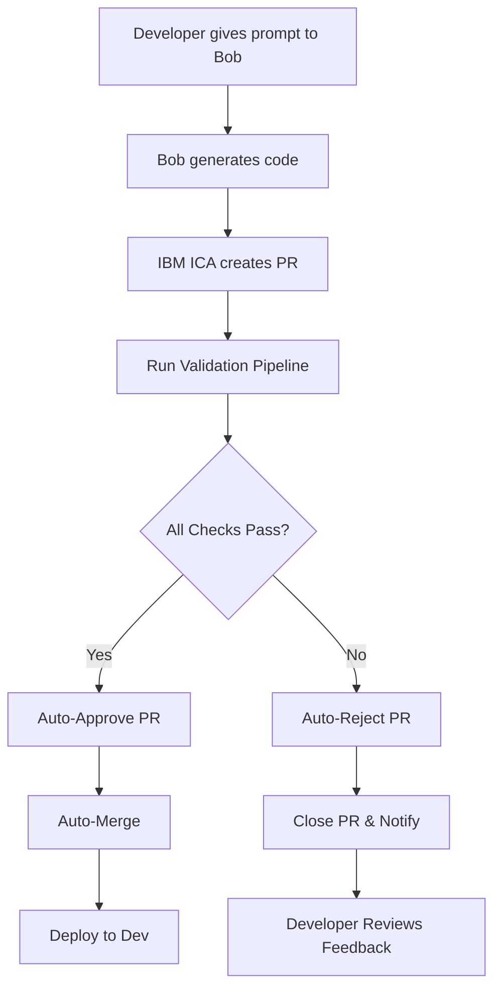

# IBM ICA + Bob AI - Automated PR Workflow POC

## 🎯 Overview

This POC demonstrates an automated workflow where:
1. **Bob (AI Assistant)** generates code based on your prompts
2. **IBM Cloud Automation (ICA)** automatically creates a Pull Request
3. **Automated validation** runs (code quality, tests, security)
4. **Auto-approve** if validation passes OR **Auto-reject** if validation fails

## 🏗️ Architecture

```
┌─────────────┐
│   You       │
│  (Developer)│
└──────┬──────┘
       │ 1. Give prompt
       ▼
┌─────────────┐
│    Bob      │
│ (AI Agent)  │
└──────┬──────┘
       │ 2. Generate code
       ▼
┌─────────────┐
│  IBM ICA    │
│  Workflow   │
└──────┬──────┘
       │ 3. Create PR
       ▼
┌─────────────────────────────┐
│  Validation Pipeline        │
│  ├─ Code Quality (SonarQube)│
│  ├─ Build (Maven)           │
│  ├─ Tests (JUnit)           │
│  └─ Security (Snyk, OWASP)  │
└──────┬──────────────────────┘
       │
       ├─ ✅ All Pass ──────────┐
       │                        ▼
       │                  ┌──────────┐
       │                  │ Approve  │
       │                  │ & Merge  │
       │                  └──────────┘
       │
       └─ ❌ Any Fail ─────────┐
                               ▼
                         ┌──────────┐
                         │  Reject  │
                         │ & Close  │
                         └──────────┘
```

## 📁 Files Created

### 1. `ibm-ica-pr-workflow.yaml`
Main IBM ICA configuration defining:
- PR creation rules
- Validation pipeline steps
- Auto-approval/rejection conditions
- Notifications and metrics

### 2. `.github/workflows/bob-ica-validation.yml`
GitHub Actions workflow that:
- Identifies Bob-generated PRs
- Runs validation checks
- Sends results to IBM ICA
- Auto-approves or rejects PRs

### 3. `ibm-ica-config.yaml`
Deployment configuration for IBM Cloud

## 🚀 Setup Instructions

### Prerequisites

1. **IBM Cloud Account**
   - IBM Cloud Automation (ICA) enabled
   - API key generated

2. **GitHub Repository**
   - Admin access
   - GitHub Actions enabled

3. **Required Tools**
   - SonarQube instance
   - Snyk account
   - Maven 3.6+
   - Java 11+

### Step 1: Configure GitHub Secrets

Add these secrets to your GitHub repository:

```bash
# IBM Cloud
IBM_ICA_API_URL=https://ica.ibm.com/api/v1
IBM_CLOUD_API_KEY=your-ibm-cloud-api-key

# Code Quality
SONAR_URL=https://sonarqube.example.com
SONAR_TOKEN=your-sonar-token

# Security
SNYK_TOKEN=your-snyk-token
```

**How to add secrets:**
1. Go to GitHub repository → Settings → Secrets and variables → Actions
2. Click "New repository secret"
3. Add each secret with its value

### Step 2: Configure IBM ICA

1. **Upload workflow configuration:**
```bash
ibmcloud ica workflow create \
  --file ibm-ica-pr-workflow.yaml \
  --name bob-pr-workflow
```

2. **Set up API authentication:**
```bash
ibmcloud ica api-key create \
  --name bob-integration \
  --description "API key for Bob AI integration"
```

3. **Configure webhook:**
```bash
ibmcloud ica webhook create \
  --url https://api.github.com/repos/YOUR_ORG/calculator-project/dispatches \
  --events validation-complete,pr-approved,pr-rejected
```

### Step 3: Test the Workflow

1. **Generate code with Bob:**
   ```
   You: "Add a square root function to the calculator"
   Bob: [Generates code]
   ```

2. **Bob creates a branch:**
   ```bash
   git checkout -b bob-generated-square-root-feature
   git add .
   git commit -m "Add square root function"
   git push origin bob-generated-square-root-feature
   ```

3. **IBM ICA automatically:**
   - Creates PR
   - Triggers validation pipeline
   - Approves/rejects based on results

## 🔍 Validation Checks

### 1. Code Quality (SonarQube)
- **Checks:** Code smells, bugs, vulnerabilities
- **Threshold:** Quality gate must pass
- **Fail condition:** Critical issues found

### 2. Build Verification
- **Checks:** Compilation success
- **Command:** `mvn clean compile`
- **Fail condition:** Build errors

### 3. Unit Tests
- **Checks:** All tests pass
- **Command:** `mvn test`
- **Coverage:** Minimum 70%
- **Fail condition:** Any test fails

### 4. Security Scan
- **Tools:** Snyk, OWASP Dependency Check
- **Checks:** Vulnerabilities in code and dependencies
- **Fail condition:** High/Critical vulnerabilities found

## ✅ Auto-Approval Criteria

PR is **automatically approved** when:
- ✅ All validation checks pass
- ✅ No security vulnerabilities
- ✅ Build successful
- ✅ 100% tests pass
- ✅ Code quality gate passed

**Actions on approval:**
1. Add "validated" label
2. Remove "needs-validation" label
3. Convert from draft PR
4. Add approval comment
5. Auto-merge (squash)
6. Delete source branch

## ❌ Auto-Rejection Criteria

PR is **automatically rejected** when:
- ❌ Any validation check fails
- ❌ Security issues found
- ❌ Build fails
- ❌ Tests fail
- ❌ Code quality gate fails

**Actions on rejection:**
1. Add "validation-failed" label
2. Add detailed comment with issues
3. Close PR
4. Send notification

## 📊 Monitoring & Metrics

IBM ICA tracks:
- PR creation time
- Validation duration
- Approval rate
- Rejection rate
- Merge time

**Access dashboard:**
```
https://ica.ibm.com/dashboard/bob-pr-workflow
```

## 🔔 Notifications

### Slack Integration
Configure Slack webhook in `ibm-ica-pr-workflow.yaml`:
```yaml
notifications:
  onCreate:
    - type: slack
      channel: "#code-generation"
      webhook: https://hooks.slack.com/services/YOUR/WEBHOOK/URL
```

### Email Notifications
Update email addresses in the workflow file:
```yaml
notifications:
  onApprove:
    - type: email
      to: your-email@example.com
```

## 🧪 Example Usage

### Example 1: Add New Feature

**Prompt to Bob:**
```
Add a percentage calculation button to the calculator
```

**Bob generates:**
- New button in UI
- Percentage calculation logic
- Unit tests

**IBM ICA:**
1. Creates PR: `[Bob Generated] Add percentage calculation`
2. Runs validation (2-3 minutes)
3. ✅ Approves and merges (all checks pass)

### Example 2: Fix Bug

**Prompt to Bob:**
```
Fix the division by zero error handling
```

**Bob generates:**
- Updated error handling
- Additional test cases

**IBM ICA:**
1. Creates PR: `[Bob Generated] Fix division by zero`
2. Runs validation
3. ✅ Approves and merges

### Example 3: Validation Failure

**Prompt to Bob:**
```
Add database connection (without proper security)
```

**Bob generates:**
- Database connection code
- Missing security measures

**IBM ICA:**
1. Creates PR
2. Runs validation
3. ❌ **Security scan fails** (SQL injection risk)
4. Rejects PR with detailed feedback
5. Closes PR

## 🛠️ Troubleshooting

### Issue: PR not created automatically

**Solution:**
1. Check IBM ICA API connectivity
2. Verify GitHub token permissions
3. Check branch naming pattern

### Issue: Validation stuck

**Solution:**
1. Check GitHub Actions logs
2. Verify SonarQube/Snyk connectivity
3. Check timeout settings

### Issue: Auto-merge not working

**Solution:**
1. Verify GitHub branch protection rules
2. Check merge permissions
3. Ensure all required checks pass

## 📝 Configuration Files Reference

### Branch Naming Convention
```
bob-generated-{feature-name}
```

### PR Labels
- `bob-generated` - Identifies Bob-created PRs
- `automated-pr` - Marks as automated
- `needs-validation` - Pending validation
- `validated` - Passed all checks
- `validation-failed` - Failed checks

### Required GitHub Permissions
- `contents: write` - Push code
- `pull-requests: write` - Create/update PRs
- `checks: write` - Update check status

## 🔐 Security Considerations

1. **API Keys:** Store in GitHub Secrets, never commit
2. **Branch Protection:** Enable for main/develop branches
3. **Code Review:** Consider requiring human review for critical changes
4. **Audit Logs:** IBM ICA maintains full audit trail

## 📈 Success Metrics

Track these KPIs:
- **Automation Rate:** % of PRs auto-approved
- **Validation Time:** Average time to validate
- **Rejection Rate:** % of PRs rejected
- **Time to Merge:** From generation to merge

## 🎓 Best Practices

1. **Clear Prompts:** Give Bob specific, detailed prompts
2. **Incremental Changes:** Small, focused changes validate faster
3. **Test Coverage:** Ensure Bob generates tests
4. **Security First:** Always include security considerations
5. **Documentation:** Bob should update docs with code

## 🔄 Workflow Diagram



## 📞 Support

- **IBM ICA Documentation:** https://www.ibm.com/docs/ica
- **GitHub Actions:** https://docs.github.com/actions
- **Bob AI Support:** Contact your AI assistant administrator

## 📄 License

This POC configuration is provided as-is for demonstration purposes.

---

**Created by Bob AI Assistant**
**Last Updated:** 2026-05-21